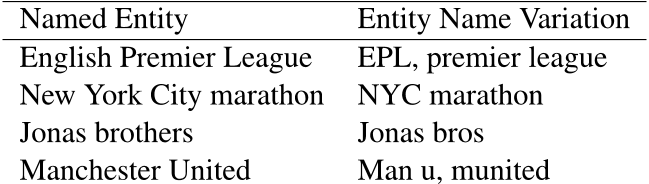
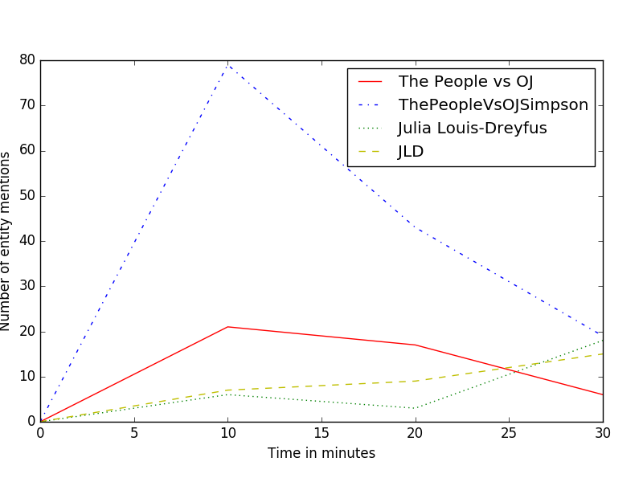

# Research Statement

(Last updated {{ site.time | date: "%B %d, %Y" }}) 

Over time, human knowledge has mostly been expressed in text, some of which are unstructured. To make sense of these knowledge and understand the nuances of human language, computers have to be able to extract structured knowledge from unstructured text. In certain languages, semantically similar sentences could be worded differently and words are sometimes ambiguous, hence the specific sense of a word intended in a sentence is determined by the context in which an instance of the ambiguous word appears. Additionally, due to the lack of uniformity in individual writing styles, multiple people can express the same word, phrase, or sentence differently(e.g. a sports team could be referred to by its official name, the name of the city it plays in, or by any of several nicknames). These make it challenging to find similar words, phrases, and sentences that express the same information, in text.

My research interest focuses on applying machine learning to better understand the various ways in which words, phrases, and sentences are expressed. Currently, I have two main areas of research: Question Answering and Paraphrase detection. 

## Community Question Answering Systems

Community question answering (CQA) systems are online forums where users can ask and answer questions in various categories. A common challenge with these systems is that a significant percentage of asked questions are left unanswered, partly because: (I) they are short and lack relevant content, (II) they are not clearly expressed, and (III) they are not appropriately assigned to a user that is able to answer the question. In my research, my collaborators and I proposed the idea of using entity-based algorithms to reduce the number of unanswered questions in entity-rich question categories (e.g. Sports and Entertainment) of CQA's by using past resolved questions (PARQ) from the site. In these entity-rich question categories, the vocabulary in questions can be diverse, and questions are often very short. We created a new dataset constructed from Yahoo! Answers. The dataset contains annotated question pairs, (given question, PARQ, and its corresponding answer) from the Sports and Entertainment question categories. We show that in question categories with lots of entities and entity variations, using entities, disambiguated entities, and extracting KB information associated with these entities will find most of the PARQ with shared needs or similar needs as given questions.  Table 1 presents some of the named entities and their variations in our dataset.

 
<b>Table 1:</b> Some named entities and their variations in our dataset.

## Paraphrase detection

In certain fields, real-time knowledge from events can help in making informed decisions. In order to extract pertinent realtime knowledge related to an event, it is important to identify the named entities and their corresponding aliases related to the event. The problem of identifying aliases of named entities that spike has remained unexplored. In this paper, we introduce an algorithm, EntitySpike, that identifies entities that spike in popularity in tweets from a given time period, and constructs an alias list for these spiked entities. EntitySpike uses a temporal heuristic to identify named entities with similar context that occur in the same time period (within minutes) during an event. Each entity is encoded as a vector using this temporal heuristic.We show how these entityvectors can be used to create a named entity alias list. We evaluated our algorithm on a dataset of temporally ordered tweets from a single event, the 2013 Grammy Awards show. We carried out various experiments on tweets that were published in the same time period and show that our algorithm identifies most entity name aliases and outperforms a competitive baseline.

 
<b>Table 1:</b> Name variations of entities that spike in popularity at the same time in 10 minute bins during the 2016 Emmy awards show.

<!--## Natural Language Understanding via Paraphrasing-->

<!--
-->
<!--
-->
<!-- -->
<!--<b>Figure 1:</b> The German <i>festgenommen</i> links the English phrase <i>thrown into jail</i> to its paraphrase <i>imprisoned</i>. -->
<!--
-->
<!--

-->
<!--
-->
<!-- -->
<!--<b>Figure 1:</b> The German <i>festgenommen</i> links the English phrase <i>thrown into jail</i> to its paraphrase <i>imprisoned</i>. -->
<!--
-->
<!--
-->

<!--I developed a method that extracts paraphrases from bilingual parallel corpora  by identifying equivalent English expressions using a shared foreign phrase.  This ensures that their meaning is similar.  Figure 1 illustrates the method ([Bannard and Callison-Burch (2005)](#paraphrasing-with-bilingual-parallel-corpora), [Callison-Burch (2007)](#callison-burch-thesis)).  *Thrown into jail* occurs many times in the training data, aligning with several different foreign phrases. Each of these may align with a variety of other English paraphrases. Thus, *thrown into jail* not only paraphrases as *imprisoned*, but also as *arrested, detained, incarcerated, jailed, locked up, taken into custody*, and *thrown into prison*.  However, not all the paraphrases are uniformly good.  The baseline method also extracts candidate paraphrases that mean the same thing, but do not share the same syntactic category as the original phrase, such as *be thrown in prison, been thrown into jail, being arrested, in jail, in prison, put in prison for, were thrown into jail,* and *who are held in detention*. It is also prone to generating many bad paraphrases, such as *maltreated, thrown, cases, custody, arrest, owners,* and *protection*, because of noisy/inaccurate word alignments and other problems.  Separating good paraphrases from bad presents fascinating research challenges ([Pavlick et al (2015)](#ppdb-reranking)).-->

<!--
-->
<!--
-->
<!-- -->
<!--<b>Figure 2:</b> We learn the English possessive rule by pivoting over SCFG translation rules.-->
<!--
-->
<!--
-->
<!--
-->
<!--
-->
<!-- -->
<!--<b>Figure 2:</b> We learn the English possessive rule by pivoting over SCFG translation rules.-->
<!--
-->
<!--
-->

<!--I have extended the bilingual pivoting methodology to syntactic representations of translation rules.  This builds on my research group's work into adding syntactic information into statistical machine translation rules. We have adopted a synchronous context free grammar (SCFG) representation for our Joshua decoder, and we demonstrated that it is useful for translating between languages with different word orders like Urdu's subject-object-verb order and English's subject-verb-object order-->
<!--([Baker et al (2010)](#semantically-informed-syntactic-machine-translation)).  Instead of pivoting over foreign phrases, we can pivot over foreign SCFG rules, as shown in Figure 2. This allows us to automatically acquire meaning-preserving syntactic transformations like the English possessive rule.  This rule is a general transformation that can apply to most noun phrases in English.  It allows us to recognize that *the laptop's screen* can be rewritten as *the screen of the laptop*. Table 1 shows a variety of other meaning-preserving structural transformations that we learn in this way ([Ganitkevitch et al (2011)](#learning-sentential-paraphrases-from-bilingual-parallel-corpora)).-->

<!--
-->
<!-- -->
<!--<b>Table 1:</b> We are able to automatically acquire a variety of meaning-preserving structural translations in English by pivoting over SCFG translation rules.-->
<!--
-->

<!--We used my bilingual pivoting technique to create the paraphrase database, called PPDB for short  ([Ganitkevitch et al, 2013](#ppdb)).   PPDB contains 8 million synonyms, 68 million phrasal paraphrases, and 94 million meaning-preserving syntactic transformations.  PPDB is freely available from our web site [paraphrase.org](http://paraphrase.org/#/search?q=freely%20available&filter=&lang=en).  It is a much larger resource than the manually-constructed WordNet resource that is heavily used in NLP research.  PPDB has made immediate impact and was widely adopted by other researchers.  It has been cited 185 times in the three years since its publication, and it was central to the research described in the NAACL 2015 best paper ([Faruqui et al, 2015](http://aclweb.org/anthology/N/N15/N15-1184.pdf)) on retrofitting word vectors to semantic lexicons.  The NAACL paper shows that PPDB has enormous potential for improving deep learning of word embeddings.  I plan to explore this connection further. -->

<!--
-->
<!-- -->
<!--<b>Table 2:</b> Examples of different types of entailment relations appearing in PPDB.-->
<!--
-->

<!--Over the past two years we made several advances to PPDB that improve its usefulness for understanding natural language:-->

<!--- **Semantics**:  In [Pavlick et al (2015)](#adding-semantics-to-data-driven-paraphrasing), we add an interpretable semantics to PPDB. The relationship between the phrase pairs in the database had been defined as approximately equivalent.  Our new research allows these pairs to be encoded with more nuanced semantic relations, including directed entailment (*little girl/girl*) and exclusion (*nobody/someone*). We automatically assign semantic entailment relations to all 100 million entries in PPDB using features derived from past work on discovering inference rules from text and semantic taxonomy induction.  Examples are given in Table 2.-->

<!--
-->
<!--
-->
<!-- -->
<!-- -->
<!--<b>Figure 3:</b> We partition paraphrases of an input word like bug into clusters representing its distinct senses.-->
<!--
-->
<!--
-->
<!--
-->
<!--
-->
<!-- -->
<!-- -->
<!--<b>Figure 3:</b> We partition paraphrases of an input word like bug into clusters representing its distinct senses.-->
<!--
-->
<!--
-->

<!--- **Domain adaptation**: Language is used differently in different domains.  In [Pavlick et al (2015)](#domain-specific-paraphrases) we demonstrate an algorithm that is able to automatically adapt paraphrases to suit a particular domain.  For instance, paraphrase of the word *divide* when used in biology should include *division, break, split, dispense, multiply, cleave, fracture, separate, mitotic division, partition* since it refers to cellular division/multiplication.  In a parliamentary domain it more commonly refers to the divide between rich and poor, and should be paraphrased as *gap, division, gulf, separate, distinction, rift, difference*.-->
<!--- **Natural language generation**: Paraphrases are useful in the generation components of dialog systems like Apple's Siri, question answering, and automatic summarization. We are investigating using paraphrases for text to text generation.  Given an input text, rewrite it subject to constraints: for summarization make it shorter; for simplification use words that are easier to understand; for poetry generation conform to a meter and a rhyming scheme.  In [Xu et al (2015)](#new-data-for-text-simplification) and [Xu et al (2016)](#optimizing-machine-translation-for-text-simplifciation), we show how paraphrasing and machine translation techniques can be used for the problem of text simplification.  -->
<!--- **Word sense clustering**: The original release of PPDB grouped all senses of polysemous words together, and did not partition paraphrases into groups like WordNet does with its synsets. Thus a search for paraphrases of the noun *bug* would yield a single list of paraphrases that includes *insect, glitch, beetle, error, microbe, wire, cockroach, malfunction, microphone, mosquito, virus, tracker, pest, informer, snitch, parasite, bacterium, fault, mistake, failure* and many others.   In [Cocos and Callison-Burch (2016)](#clustering-paraphrases-by-word-sense), we systematically explore different clustering algorithms, and ways of defining the similarity matrix that they use as input (Figure 3). We produce high quality sense clusters that represent a substantial improvement to PPDB.  We are currently exploring using our sense clusters to perform word sense disambiguation.-->

<!--The goal of the paraphrasing line of my research is to advance the longstanding AI goal of language understanding  data-driven methods and statistical models.  If successful, it has the potential to impact a wide variety of NLP tasks including information retrieval, question answering, and machine translation.  My research into this area has been sponsored by two NSF EAGER awards, multiple grants from the Allen Institute for Artificial Intelligence (AI2) and its predecessor Vulcan, and a $1.6 million DARPA DEFT award.  I have submitted an NSF CAREER proposal on this topic.  It is currently under review.-->

<!--## Statistical Machine Translation Without Parallel Corpora-->

<!--
-->
<!--
-->
<!-- -->
<!--<b>Figure 4:</b> Example of projecting contextual vectors over a seed bilingual lexicon.-->
<!--
-->
<!--
-->
<!--
-->
<!--
-->
<!-- -->
<!--<b>Figure 4:</b> Example of projecting contextual vectors over a seed bilingual lexicon.-->
<!--
-->
<!--
-->

<!--Statistical machine translation has long been purported to be "language independent" since linguistic information is not typically used when training systems.  This has been touted as a strength of the paradigm, because the only requirement for building a  new system is a sentence-aligned bilingual parallel corpus.  However, this language independence does not mean that statistical machine translation works equally well for every language.  Translation quality depends on many factors, including the amount of training data, morphological complexity, and divergences in word order.  Since very large parallel corpora are required to achieve good translation quality, statistical machine translation can, in reality, only be applied to a very limited number of languages. My research agenda for the next decade is to transform statistical machine translation so that (1) models can be trained without the use bilingual parallel corpora, (2) linguistic information can be integrated directly into the models and as priors for learning translations and re-ordering patterns, and (3) large groups of Internet users can collaborate to improve translation quality.   If successful, these efforts will radically change the field and make statistical machine translation applicable to (nearly) all of the world's languages.-->

<!--
-->
<!--
-->
<!-- -->
<!--<b>Figure 5:</b> The temporal histograms are collected from monolingual texts spanning several years and show the number of occurrences of each word (on the y-axes) across time. While the correct translation has a good temporal match, the non-translations are less temporally similar.-->
<!--
-->
<!--
-->
<!--
-->
<!--
-->
<!-- -->
<!--<b>Figure 5:</b> The temporal histograms are collected from monolingual texts spanning several years and show the number of occurrences of each word (on the y-axes) across time. While the correct translation has a good temporal match, the non-translations are less temporally similar.-->
<!--
-->
<!--
-->
 
<!--Like other statistical NLP systems and machine learning applications, the  performance of statistical machine translation improves as more training data is used.   For a few language pairs, we have tremendous amounts of training data --  I created a French-English parallel corpus with nearly 1 billion words on  each side, the DARPA GALE program produced Arabic-English and Chinese-English parallel corpora with 250 million words in each language, and we have somewhere on the order of 50--100 million words worth of parallel data for the official languages of the European Union.  However, for most language pairs, we have comparatively tiny amounts of bilingual training data, which means that current statistical machine translation techniques will not work.  -->

<!--To build statistical machine translation systems without parallel corpora, I have revived research started by <a href="http://www.aclweb.org/anthology/P/P99/P99-1067.pdf">Rapp (1999)</a>, who investigated  inducing bilingual lexicons from monolingual texts.  The method uses vector-space semantic models to build a context vector representing words whose  translations are unknown.  The elements in an unknown word's vector are projected into the vector space of the other language using the known translations from a small seed bilingual dictionary.  This sparse projected vector is compared to the vectors for all words in the target language.  The word whose vector is most similar to the projected vector is considered to be the best translation of the unknown word  This process is illustrated in Figure 4.  I have successfully replicated the results of Rapp (1999), and used the method to estimate the parameters of phrase-based statistical machine translation systems .-->
<!--<a href="#toward-statistical-machine-translation-without-parallel-corpora">(Klementiev et al (2012)</a>, <a href="#end-to-end-smt-with-zero-or-small-bitexts">(Irvine and Callison-Burch (2015))</a>.  The advantage of this paradigm is that it only requires a small bilingual dictionary and large monolingual corpora, rather than bilingual parallel data.-->

<!--My students and I have examined combining a diverse set of monolingually-derived signals of translation equivalence ([Irvine and Callison-Burch (2013)](#supervised-bilingual-lexicon-induction)). In addition to vector space models, we have incorporated a diverse set of signals including temporal similarity (Figure 5), orthographic similarity,  and topical similarity.  Table 3 shows examples of the highest ranking English translations of 5 Spanish words for several of our signals of translation equivalence.  Each signal produces different types of errors.(For instance, using topic similarity, *montana, miley*, and *hannah* are ranked highly as candidate translations of the Spanish word *montana*.--> 
<!--The TV character Hannah Montana is played by actress Miley Cyrus, so the topic similarity between these words makes sense.)-->  

<!--
-->
<!--
-->
<!-- -->
<!--<b>Table 3:</b> Examples of translation candidates ranked using contextual  similarity, temporal similarity, orthographic similarity and topic similarity. The correct English translations, when found, are bolded.-->
<!--
-->
<!--
-->
<!--
-->
<!--
-->
<!-- -->
<!--<b>Table 3:</b> Examples of translation candidates ranked using contextual  similarity, temporal similarity, orthographic similarity and topic similarity. The correct English translations, when found, are bolded.-->
<!--
-->
<!--
-->

<!--My group has conducted a study of bilingual lexicon induction on a wide range of languages and data sizes ([Irvine and Callison-Burch (accepted)](#discriminative-bilingual-lexicon-induction)). We examine translation into  English from 25 foreign languages: Albanian, Azeri, Bengali, Bosnian, Bulgarian, Cebuano, Gujarati, Hindi, Hungarian, Indonesian, Latvian, Nepali, Romanian, Serbian, Slovak, Somali, Spanish, Swedish, Tamil, Telugu, Turkish, Ukrainian, Uzbek, Vietnamese and Welsh.  Rather than testing solely on high frequency words, as previous research has done, we test on low frequency as well, so that our results are more relevant to statistical machine translation, where systems typically lack translations of rare words that fall outside of their training data.  We systematically explore a wide range of features and phenomena that affect the quality of the translations discovered by bilingual lexicon induction. We give illustrative examples of the highest ranking translations for orthogonal signals of translation equivalence like contextual similarity and temporal similarity.  We analyze the effects of frequency and burstiness, and the sizes of the seed bilingual dictionaries and the monolingual training corpora.  Our model performs better than the previous state-of-the-art matching canonical correlation analysis (MCCA) algorithm, achieving an accuracy of 42% versus MCCA's 15%.-->

 
 
 
<!--My goal is to go beyond simply expanding bilingual dictionaries so that we can use bilingual lexicon induction techniques in order to produce full translations systems.  I am extending the model to translations of phrases (instead of just words), to calculate translation probabilities, and to predict word order of translations.  My research has been supported by two DARPA grants -- a $500k follow-on grant to my participation in the DARPA Computer Science Study Group, and a new $450k multi-year DARPA LORELEI project.-->
 

<!--## Crowdsourcing-->

<!--My third research focus is crowdsourcing.  The idea of using crowdsourcing to create annotated data for natural language processing applications is a relatively new topic, and it raises a number of scientific challenges. Rather than treating annotated training data as a gold standard created by experts whose labels are authoritative, we must cope with the fact that we have anonymous, non-expert annotators whose labels are noisy and who may not even be doing the task conscientiously. We build models of the annotators themselves, and use those models to create high quality labeled training data by soliciting redundant labels and making predictions about which labels and which annotators are most likely to be correct. The ability to accurately model the annotators has direct implications for the cost of creating a labeled training data set, since we can decide how much to trust a given annotator's label and whether soliciting a redundant label would be likely to improve the accuracy. -->

<!--
-->
<!-- -->
<!--<b>Figure 6:</b> A comparison of the translation quality (approximated by Bleu score) for professionals against different ways of selecting the Turker translations from among 4 redundant translations. --> 
<!--
-->

<!--One of my first successes with crowdsourcing for NLP was to show that the quality of Urdu-English translations produced by non-professional translators can be made to approach the quality of professional translation at a fraction of the cost  ([Zaidan and Callison-Burch (2011)](#crowdsourcing-translation))  Figure 6 highlights the main findings of the study.  It shows that through judicious application of quality control techniques, crowdsourced translations can fall in the range that we would expect of professional translators. This, combined with the fact that crowdsourced translations are more than an order of magnitude cheaper, opens the real possibility of creating training data for SMT, previously thought to be too expensive to create from scratch. I have established myself as one of the foremost experts in crowdsourcing as applied to language ([Callison-Burch and Dredze (2010)](#creating-speech-and-language-data-with-amazon-mechanical-turk))  . I have used crowdsourcing to create a wide range of new NLP data sets, which approach the size and quality of ones produced by the Linguistics Data Consortium (LDC).   Here's a sample of what I have produced:-->

<!--* A large scale evaluation of machine translation output by crowd workers with a comprehensive comparison against expert annotators and recommendations for quality control-->
<!--([Callison-Burch et al (2010)](#findings-of-wmt10-and-metrics-matr)).-->
<!--* An Arabic dialect corpus with manual classification of the dialect for 150k sentences harvested from the online comments of Arabic newspapers from different countries.  We used this data to train a system that could automatically identify Arabic dialects-->  
<!--([Zaidan and Callison-Burch (2011)](#arabic-dialect-corpus)).-->
<!--* Translations of 1.5 million words worth of Egyptian Arabic and Levine Arabic  data.  This allowed us to train a statistical machine translation system to translate Arabic dialect that was better than a system trained on 100 times more MSA data -->
<!--([Zbib et al (2012)](#machine-translation-of-arabic-dialects)).-->
<!--* Parallel corpora for six Indian languages.  These data sets are valuable for evaluating syntactic models of translations, since Indian languages are verb final and require a lot of long-distance reordering ([Post et al (2012)](#constructing-parallel-corpora-for-six-indian-languages-via-crowdsourcing)).-->
<!--* Translations of 1.8 million words of spoken Spanish and of 143k words of spoke Egyptian Arabic.  This data facilitates research into spoken language translation -->
<!--([Kumar et al (2014)](#callhome-egyptian-arabic-speech-translations), [Post et al (2013)](#improved-speech-to-speech-translation)).-->
<!--* A demographic study of the languages spoken by workers on the Mechanical Turk crowdsourcing platform, which resulted in bilingual dictionaries for 100 languages with 10,000 words translated in each of the languages  ([Pavlick et al (2014)](#language-demographics-of-mechanical-turk)).-->

<!--My research into crowdsourcing for NLP has been facilitated by a $500,000 DARPA grant, two Google faculty research awards totaling $195,000, and approximately $100,000 towards a Mechanical Turk annotation budget from the Human Language Technology Center of Excellence.   I have a new 2 year DARPA LORELEI grant under the LDC for creating data for low resource languages using crowdsourcing. -->

<!--My interests in crowdsourcing have expanded beyond natural language processing.  I have designed a semester-long course on Crowdsourcing and Human Computation (described in my teaching statement).  I have two research projects related to social justice that use crowdsourcing.  In one project, I am designing tools to help crowd workers find better higher paying work -->
<!-- ([Callison-Burch (2014)](#crowd-workers)) (see [crowd-workers.com](http://crowd-workers.com/landing)).  In another, I am using crowdsourcing to create a [structured database of all shootings in the United States](http://gun-violence.org) to facilitate public health research (which the Republican congress has blocked the CDC and NIH from doing).  See my teaching statement for a description of the gun violence database project--> 
<!-- ([Pavlick and Callison-Burch (2016)](#gun-violence-db)).-->

## Bibliography 

  
<table class="table"> 
<tbody>


 
  
    
    
    <tr id="{{ publication.id }}">
      <td>
	
		<a href="{{ publication.url }}">{{ publication.title }}.</a>
        
		{{ publication.title }}.
	
	{{ publication.authors }}.
	{{ publication.venue }}-{{ publication.year }}.

	
	<!-- abstract button -->
	<a data-toggle="modal" href="#{{publication.id}}-abstract" class="label label-success">Abstract</a>
	<!-- /.abstract button -->
	<!-- abstract content -->
	

    

      

        

          <button type="button" class="close" data-dismiss="modal" aria-label="Close">&times;</button>
          <h4 class="modal-title" id="{{publication.id}}">{{publication.title}}</h4>
        
<!-- /.modal-header -->
        

        {{publication.abstract}}
        
<!-- /.modal-body -->
	
<!-- /.modal-content -->
	
<!-- /.modal-dialog -->
	
<!-- /.abstract-content -->
	

	
	<!-- figures button -->
	<a data-toggle="modal" href="#{{publication.id}}-figures" class="label label-primary">Figures</a>
	<!-- /.figures button -->
	<!-- figures content -->
	

    

      

        

          <button type="button" class="close" data-dismiss="modal" aria-label="Close">&times;</button>
          <h4 class="modal-title" id="{{publication.id}}">{{publication.title}}</h4>
        
<!-- /.modal-header -->
        

	 <!-- Carousel -->
	

	  <!-- Carousel items -->
	  

                
	  	
		  	
			  	

			        <b>Abstract:</b> {{publication.abstract}}
				

			  	

                		
		  	
			  	

                	
					
<b>{{figure.label}}:</b> {{figure.caption}}

				

		
	  

	  <!-- /.Carousel items -->
	  <!-- Controls -->
		<a class="left carousel-control" href="#{{publication.id}}-figures-carousel" role="button" data-slide="prev">
		
		Previous
		</a>
		<a class="right carousel-control" href="#{{publication.id}}-figures-carousel" role="button" data-slide="next">
		
		Next
		</a>
	  <!-- /.Controls -->
	

	<!-- /.Carousel -->

        
<!-- /.modal-body -->
	
<!-- /.modal-content -->
	
<!-- /.modal-dialog -->
	
<!-- /.figures-content -->
	

	
	<!-- bibtex button -->
	<a data-toggle="modal" href="#{{publication.id}}-bibtex" class="label label-default">BibTex</a>
	<!-- /.bibtex button -->
	<!-- bibtex content -->
	

    

      

        

          <button type="button" class="close" data-dismiss="modal" aria-label="Close">&times;</button>
          <h4 class="modal-title" id="{{publication.id}}">{{publication.title}}</h4>
        
<!-- /.modal-header -->
        

 	   <pre>{{publication.bibtex}}
           </pre>
        
<!-- /.modal-body -->
	
<!-- /.modal-content -->
	
<!-- /.modal-dialog -->
	
<!-- /.bibtex-content -->
	
	</td>
    <tr>
    
   
  
 


